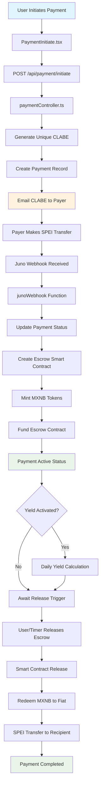
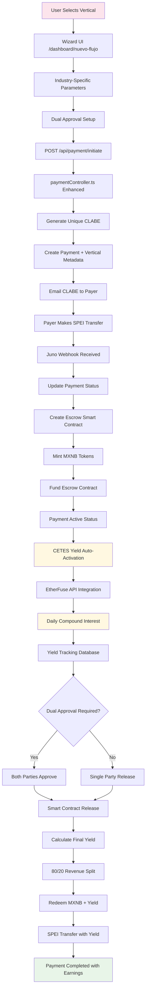
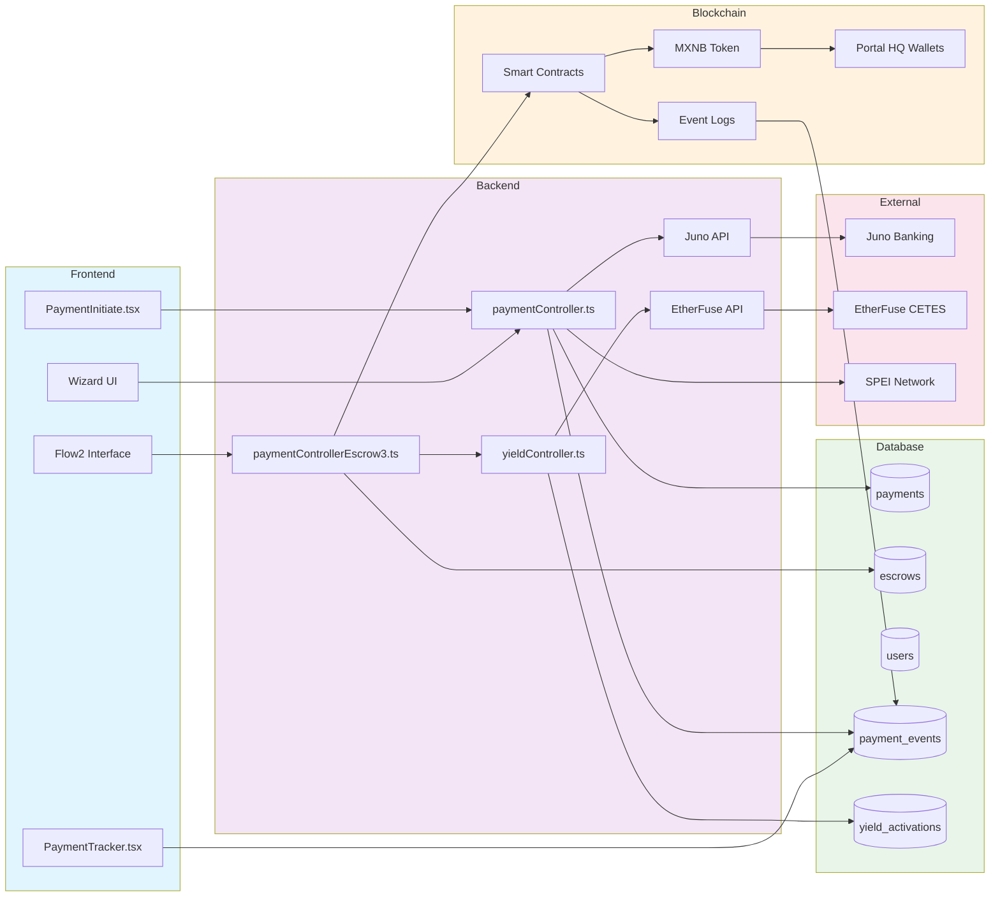
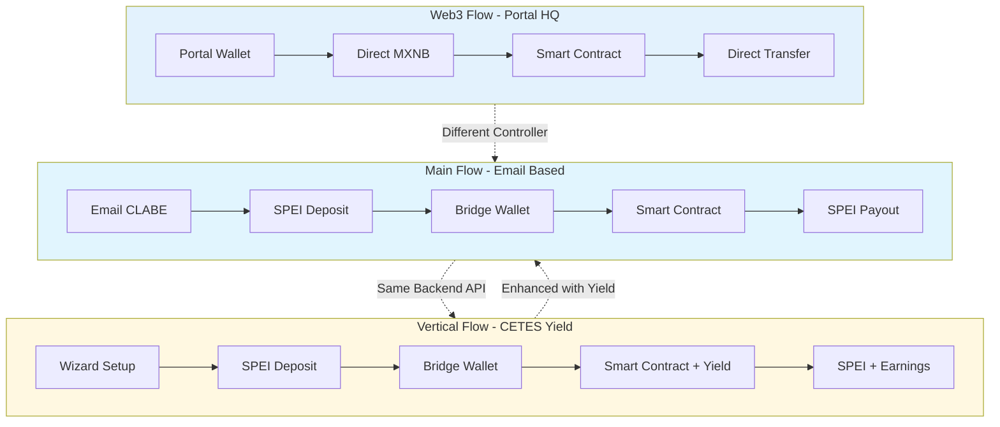

# Kustodia End-to-End Payment Flow Traceability Documentation

## Overview

This document provides comprehensive traceability for all three payment flows in Kustodia's ecosystem, mapping frontend interfaces to backend APIs, blockchain transactions, and event logging systems.

## Flow Architecture Summary

### Flow 1: Main Flow (Email-based with Wallet Bridge)
- **Target Users**: General users without crypto wallets
- **Method**: Email-based payments using CLABE deposits
- **Infrastructure**: Wallet bridge for blockchain operations
- **Frontend Paths**: `/dashboard/pagos/nuevo`, `/dashboard/pagos` (collections)

### Flow 2: Vertical Flow (Industry-Specific with Advanced Features)
- **Target Users**: Specific industry verticals with sophisticated needs
- **Method**: Wizard-based payment creation with dual approval
- **Special Features**: CETES yield integration, commission structures
- **Frontend Path**: `/dashboard/nuevo-flujo`

### Flow 3: Web3 Flow (Wallet-to-Wallet Direct)
- **Target Users**: Crypto-native users with configured wallets
- **Method**: Direct wallet-to-wallet escrow transactions
- **Infrastructure**: Direct smart contract interactions
- **Frontend Path**: `/dashboard/flow2`

---

## Flow 1: Main Flow - Complete Traceability

### Frontend Components
```
📱 PaymentInitiate.tsx (/dashboard/pagos/nuevo)
📱 PaymentRequest.tsx (/dashboard/pagos - Collections)
📱 PaymentSummary.tsx
📱 Dashboard.tsx
```

### User Journey
1. **Payment Creation**:
   - User accesses `/dashboard/pagos/nuevo`
   - Fills payment form: recipient_email, amount, description
   - System generates unique CLABE via Juno API

2. **Backend API Flow**:
   ```
   POST /api/payment/initiate
   ├── Controller: paymentController.ts → initiatePayment()
   ├── Creates unique CLABE: createJunoClabe()
   ├── Database: Creates Payment record (status: "pending")
   ├── Database: Creates Escrow record (status: "pending")
   └── Returns: payment_id, deposit_clabe, reference
   ```

3. **Deposit Detection**:
   ```
   Juno Webhook → POST /api/payment/webhook/juno
   ├── Controller: paymentController.ts → junoWebhook()
   ├── Database: Updates Payment (status: "funded")
   ├── Database: Links JunoTransaction
   ├── Blockchain: Creates escrow via createEscrowOnChain()
   ├── Database: Updates Escrow (status: "active", smart_contract_escrow_id)
   └── Events: deposit_received, escrow_created
   ```

4. **Automated Processing**:
   ```
   Cron Jobs:
   ├── checkEscrowStatus.ts (Every 30 minutes)
   ├── automateClabeFlow.ts (Daily 9 AM, 3 PM, 9 PM)
   └── processAutoReleases.ts (Every 15 minutes)
   ```

5. **Release Process**:
   ```
   Manual/Auto Release Trigger
   ├── Blockchain: releaseFromEscrowToBridge.ts
   ├── Database: Updates Escrow (status: "released")
   ├── Blockchain: sendFromBridgeToJuno.ts
   ├── Juno API: redeemMXNbForMXN()
   ├── SPEI: Automatic payout to recipient
   └── Database: Updates Payment (status: "completed")
   ```

### Database Tables Involved
- `payments` (id, user_id, recipient_email, amount, status, deposit_clabe, payout_clabe)
- `escrows` (id, payment_id, custody_amount, status, smart_contract_escrow_id)
- `payment_events` (id, payment_id, type, description, created_at)
- `juno_transactions` (id, reference, type, amount, status)

### Blockchain Transactions
- **Network**: Arbitrum Sepolia
- **Contracts**: EscrowProxy, MXNB Token
- **Key Operations**:
  - `createEscrow(seller, amount, custodyAmount, custodyPeriod)`
  - `releaseEscrow(escrowId)`
  - MXNB transfers between bridge wallet and escrow contract

### Event Logging
- `payment_initiated`: Payment record created
- `deposit_received`: CLABE deposit detected
- `escrow_created`: On-chain escrow established  
- `escrow_released`: Funds released from escrow
- `mxnb_withdrawn`: Tokens moved to bridge wallet
- `spei_sent`: Fiat payout completed
- `payment_completed`: Full lifecycle completed

---

## Flow 2: Vertical Flow - Complete Traceability

### Industry Verticals Supported
1. **Inmobiliarias y agentes** (Real Estate)
2. **Freelancers y servicios** (Freelancers & Services)
3. **E-commerce y ventas online** (E-commerce)
4. **Compra-venta entre particulares** (P2P Sales)
5. **Empresas B2B y control de entregas** (B2B & Delivery Control)
6. **Marketplaces de servicios** (Service Marketplaces)

### Frontend Components
```
📱 Nuevo Flujo Wizard (/dashboard/nuevo-flujo)
├── Step 1: Vertical Selection
├── Step 2: Payment Details (amount, description, beneficiary)
├── Step 3: Custody Configuration (percentage, days)
├── Step 4: Commission Setup (optional)
└── Step 5: CETES Yield Activation (optional)

📱 PaymentTracker.tsx (Monitoring & Approvals)
```

### Enhanced Features
- **Dual Approval System**: Both payer and payee must approve
- **CETES Yield Integration**: Optional yield generation during custody
- **Commission Structures**: Multi-party commission distribution
- **Advanced Custody**: Configurable percentages and periods

### User Journey
1. **Payment Creation via Wizard**:
   ```
   Frontend: /dashboard/nuevo-flujo
   ├── Vertical Selection: Choose industry type
   ├── Payment Setup: Amount, beneficiary, description
   ├── Custody Config: Percentage (0-100%), days (1-365)
   ├── Commission Setup: Beneficiary email, percentage
   └── CETES Activation: Optional yield generation
   ```

2. **Backend API Flow**:
   ```
   POST /api/payment/initiate
   ├── Enhanced payload with vertical_type, release_conditions
   ├── Same controller as Flow 1 but with additional parameters
   ├── Database: Enhanced Payment record with vertical fields
   └── Database: Advanced Escrow configuration
   ```

3. **Dual Approval Process**:
   ```
   Payer Approval:
   POST /api/payment/:id/approve/payer
   ├── Controller: approvePaymentPayer()
   ├── Database: Updates Payment (payer_approved: true)
   └── Event: payer_approved

   Payee Approval:  
   POST /api/payment/:id/approve/payee
   ├── Controller: approvePaymentPayee()
   ├── Database: Updates Payment (payee_approved: true)
   ├── Trigger: Automatic escrow funding (if both approved)
   └── Event: payee_approved, dual_approval_complete
   ```

4. **CETES Yield Integration** (Exclusive to Vertical Flow):
   ```
   Yield Activation:
   POST /api/yield/activate
   ├── Controller: yieldController.ts → activateYield()
   ├── EtherFuse API: Initialize yield generation
   ├── Database: Creates yield_activations record
   └── Cron: Daily yield calculation and compounding

   Yield Monitoring:
   GET /api/yield/status/:paymentId
   ├── Real-time yield calculations
   ├── EtherFuse API: getCurrentRate()
   └── Database: yield_history tracking
   ```

5. **Advanced Release Conditions**:
   ```
   Conditional Release Logic:
   ├── Time-based: Automatic after custody period
   ├── Approval-based: Require dual confirmation
   ├── Milestone-based: Project completion triggers
   └── Dispute-based: Arbitration mechanisms
   ```

### CETES Yield System Architecture
```
EtherFuse Integration:
├── Production API: https://api.etherfuse.com
├── Yield Calculation: Daily compound interest (7.2% annual fallback)
├── Revenue Split: 80% to payer, 20% to platform
├── Webhook: Real-time yield event processing
└── Database: Complete yield history and payouts
```

### Database Extensions (Vertical Flow)
- `payments` (+ vertical_type, release_conditions, payer_approved, payee_approved)
- `yield_activations` (payment_id, activation_date, current_yield, status)
- `yield_history` (activation_id, calculation_date, yield_amount, cumulative_yield)
- `commission_payouts` (payment_id, beneficiary_email, amount, status)

---

## Flow 3: Web3 Flow - Complete Traceability

### Frontend Components
```
📱 Flow 2.0 Interface (/dashboard/flow2)
├── Portal HQ Integration: Custodial wallet management
├── Direct Escrow Creation: On-chain transaction builder
├── Real-time Monitoring: Blockchain event listening
└── Direct Release: Portal-signed transactions
```

### Prerequisites
- Users must have `wallet_address` configured (Portal HQ custodial wallet)
- Users must have `portal_share` percentage set
- Users need MXNB tokens in their custodial wallets
- Portal HQ wallet infrastructure active

### User Journey
1. **Custodial Wallet-Based Payment Initiation**:
   ```
   Frontend: /dashboard/flow2
   ├── Portal HQ Wallet Verification: Check custodial wallet status
   ├── Balance Check: Sufficient MXNB tokens in Portal wallet
   ├── Escrow Parameters: Direct configuration
   └── Transaction Preparation: Smart contract call data via Portal HQ
   ```

2. **Backend API Flow**:
   ```
   POST /api/payment-escrow3/initiate-wallet
   ├── Controller: paymentControllerEscrow3.ts → initiateEscrow3Payment()
   ├── Validation: wallet_address and portal_share required
   ├── Database: Creates Payment and Escrow (status: "pending")
   └── Returns: Contract ABI, addresses, transaction parameters for Portal HQ
   ```

3. **On-Chain Transaction Execution**:
   ```
   Portal HQ Custodial Wallet Interaction:
   ├── Contract: ESCROW3_CONTRACT_ADDRESS
   ├── Method: createEscrow(seller, amount, custodyAmount, days, commission)
   ├── Portal HQ: Automated transaction signing with custodial keys
   ├── Blockchain: Direct smart contract execution via Portal infrastructure
   └── Event: EscrowCreated(escrowId, payer, seller, amount, custodyAmount)
   ```

4. **Event Synchronization**:
   ```
   Backend Sync Process:
   POST /api/payment-escrow3/sync-events (Cron/Webhook triggered)
   ├── Controller: syncEscrow3Events()
   ├── Blockchain Query: Event filtering from last synced block
   ├── Database Updates: Match events to Payment/Escrow records
   └── Status Updates: Real-time status synchronization
   ```

5. **Direct Custodial Wallet Release**:
   ```
   User-Initiated Release:
   ├── Frontend: Release button → Portal HQ transaction
   ├── Contract Method: releaseEscrow(escrowId)
   ├── Portal HQ: Custodial wallet signs transaction automatically
   ├── Blockchain Event: EscrowReleased(escrowId, recipient)
   ├── Auto-Sync: Backend updates database
   └── Status: Payment marked as "completed"
   ```

### Smart Contract Events Monitored
```solidity
event EscrowCreated(uint256 indexed escrowId, address indexed payer, 
                   address indexed seller, uint256 amount, uint256 custodyAmount);
event EscrowReleased(uint256 indexed escrowId, address indexed to);
event CustodyReleased(uint256 indexed escrowId, address indexed to);
event EscrowDisputed(uint256 indexed escrowId, address indexed by);
event EscrowResolved(uint256 indexed escrowId, address indexed winner);
```

### Database Schema (Web3 Flow)
- `payments` (+ blockchain_tx_hash, smart_contract_payment_id)
- `escrows` (+ smart_contract_escrow_id, blockchain_tx_hash, contract_address)
- `users` (+ wallet_address, portal_share)
- `blockchain_events` (event_type, contract_address, transaction_hash, block_number)

---

## Cross-Flow Integration Points

### Shared Infrastructure
1. **Database**: Common Payment/Escrow entity structure
2. **Authentication**: JWT-based user authentication across flows
3. **Monitoring**: Unified dashboard for all payment types
4. **Notifications**: Email/webhook notifications for all flows

### Flow Identification
```typescript
// Payment entity discriminators
payment_type: "main_flow" | "vertical_flow" | "web3_flow"
vertical_type: "inmobiliaria" | "freelancer" | "ecommerce" | "p2p" | "b2b" | "marketplace"
```

### API Routing Structure
```
/api/payment/*           → Flow 1 (Main) & Flow 2 (Vertical)
/api/payment-escrow3/*   → Flow 3 (Web3)
/api/yield/*            → Flow 2 (Vertical) - CETES Integration
```

---

## Payment ID Traceability - Complete Identifier Chain

### Overview
Every payment in Kustodia generates a unique chain of identifiers that connect traditional banking systems (CLABE, SPEI) with blockchain operations (smart contracts, token transfers). This section provides complete traceability from payment initiation to final settlement.

### Payment Lifecycle Identifier Map

#### 1. Payment Creation Phase
```typescript
// Database Record Creation
Payment {
  id: 81,                              // Primary payment identifier
  reference: "KUS-81-2024",           // Human-readable reference
  deposit_clabe: "646180157000000081", // Unique CLABE for this payment
  payout_clabe: "012180015700000123",  // Recipient's payout CLABE
  user_id: 1,                         // Payer identifier
  recipient_email: "seller@example.com",
  amount: 5000,                       // MXN amount
  status: "pending"
}

Escrow {
  id: 45,                             // Escrow identifier
  payment_id: 81,                     // Links to payment
  custody_amount: 5000000000,         // Amount in MXNB wei (6 decimals)
  smart_contract_escrow_id: null,     // Populated after blockchain creation
  blockchain_tx_hash: null,           // Populated after on-chain creation
  status: "pending"
}
```

#### 2. CLABE Deposit Detection Phase
```typescript
// Juno Webhook Processing
JunoTransaction {
  id: 23,
  reference: "JUNO-TXN-789456123",    // Juno's internal transaction ID
  clabe: "646180157000000081",        // Matches payment's deposit_clabe
  amount: 5000,                       // Deposited amount in MXN
  type: "deposit",
  status: "completed",
  webhook_data: {
    transaction_id: "JUNO-TXN-789456123",
    spei_reference: "SPEI-REF-456789", // Banking system reference
    originating_bank: "012",           // Sender's bank code
    destination_clabe: "646180157000000081"
  }
}

// Payment Update After Deposit
Payment {
  id: 81,
  status: "funded",                   // Updated after deposit confirmation
  junoTransaction: JunoTransaction(23) // Linked to Juno transaction
}
```

#### 3. Blockchain Escrow Creation Phase
```typescript
// Smart Contract Deployment
const escrowCreationTx = await createEscrowOnChain(
  sellerWallet: "0x742d35cc6681c4c8e2d4c3b9e6a47b2a...", // Recipient wallet
  amount: "5000000000",              // 5000 MXNB in wei
  custodyAmount: "5000000000",       // Full amount in custody
  custodyPeriod: 30                  // 30 days custody period
);

// Blockchain Transaction Result
EscrowCreationResult {
  txHash: "0xa1b2c3d4e5f6789012345678901234567890abcdef1234567890abcdef123456",
  escrowId: "42",                    // Smart contract generated escrow ID
  blockNumber: 1234567,
  gasUsed: 180000,
  contractAddress: "0x1234567890123456789012345678901234567890" // Escrow contract
}

// Database Update After Blockchain Confirmation
Escrow {
  id: 45,
  smart_contract_escrow_id: "42",    // From blockchain escrowId
  blockchain_tx_hash: "0xa1b2c3d4e5f6789012345678901234567890abcdef1234567890abcdef123456",
  contract_address: "0x1234567890123456789012345678901234567890",
  status: "active"
}

Payment {
  id: 81,
  blockchain_tx_hash: "0xa1b2c3d4e5f6789012345678901234567890abcdef1234567890abcdef123456",
  smart_contract_payment_id: "42",
  status: "escrowed"
}
```

#### 4. MXNB Token Issuance & Transfer Phase
```typescript
// Juno to Bridge Wallet Transfer (Off-chain to On-chain)
const mintTx = await junoService.withdrawToAddress(
  "0x9876543210987654321098765432109876543210", // Bridge wallet address
  5000,                              // Amount in MXNB
  "KUS-81-MINT"                     // Reference linking to payment
);

// MXNB Mint Transaction
MXNBMintTransaction {
  txHash: "0xb2c3d4e5f6789012345678901234567890abcdef1234567890abcdef1234567a",
  fromAddress: "0x0000000000000000000000000000000000000000", // Mint from zero
  toAddress: "0x9876543210987654321098765432109876543210",   // Bridge wallet
  amount: "5000000000",             // 5000 MXNB in wei
  blockNumber: 1234568,
  gasUsed: 95000
}

// Bridge to Escrow Transfer
const fundEscrowTx = await bridgeWallet.transfer(
  MXNB_CONTRACT_ADDRESS,
  ESCROW_CONTRACT_ADDRESS,
  "5000000000"                      // Amount to fund escrow
);

// MXNB Transfer Transaction  
MXNBTransferTransaction {
  txHash: "0xc3d4e5f6789012345678901234567890abcdef1234567890abcdef1234567ab2",
  fromAddress: "0x9876543210987654321098765432109876543210", // Bridge wallet
  toAddress: "0x1234567890123456789012345678901234567890",   // Escrow contract
  amount: "5000000000",
  blockNumber: 1234569,
  escrowId: "42"                    // Links to smart contract escrow
}
```

#### 5. Escrow Funding Confirmation Phase
```typescript
// Smart Contract Event Emission
EscrowFundedEvent {
  txHash: "0xc3d4e5f6789012345678901234567890abcdef1234567890abcdef1234567ab2",
  contractAddress: "0x1234567890123456789012345678901234567890",
  eventName: "EscrowFunded",
  args: {
    escrowId: "42",
    amount: "5000000000",
    fundedBy: "0x9876543210987654321098765432109876543210"
  },
  blockNumber: 1234569
}

// Database Synchronization
Escrow {
  id: 45,
  funding_tx_hash: "0xc3d4e5f6789012345678901234567890abcdef1234567890abcdef1234567ab2",
  funded_amount: "5000000000",
  funded_at: "2024-01-15T10:30:00Z",
  status: "funded"
}

PaymentEvent {
  id: 156,
  payment_id: 81,
  type: "escrow_funded",
  description: "Escrow funded with 5000 MXNB",
  blockchain_tx_hash: "0xc3d4e5f6789012345678901234567890abcdef1234567890abcdef1234567ab2",
  created_at: "2024-01-15T10:30:00Z"
}
```

#### 6. Escrow Release Phase
```typescript
// Release Trigger (Manual or Automatic)
const releaseTx = await escrowContract.releaseEscrow(
  42,                               // escrowId from smart contract
  "0x742d35cc6681c4c8e2d4c3b9e6a47b2a..." // Recipient wallet address
);

// Escrow Release Transaction
EscrowReleaseTransaction {
  txHash: "0xd4e5f6789012345678901234567890abcdef1234567890abcdef1234567ab2c3",
  contractAddress: "0x1234567890123456789012345678901234567890",
  escrowId: "42",
  releasedTo: "0x742d35cc6681c4c8e2d4c3b9e6a47b2a...",
  amount: "5000000000",
  blockNumber: 1234570,
  gasUsed: 95000
}

// Smart Contract Event
EscrowReleasedEvent {
  txHash: "0xd4e5f6789012345678901234567890abcdef1234567890abcdef1234567ab2c3",
  args: {
    escrowId: "42",
    releasedTo: "0x742d35cc6681c4c8e2d4c3b9e6a47b2a...",
    amount: "5000000000"
  }
}

// Database Updates
Escrow {
  id: 45,
  release_tx_hash: "0xd4e5f6789012345678901234567890abcdef1234567890abcdef1234567ab2c3",
  released_to: "0x742d35cc6681c4c8e2d4c3b9e6a47b2a...",
  released_at: "2024-01-15T14:20:00Z",
  status: "released"
}
```

#### 7. MXNB to MXN Redemption Phase
```typescript
// Bridge Wallet Receives Released Funds
const bridgeReceiveTx = "0xd4e5f6789012345678901234567890abcdef1234567890abcdef1234567ab2c3";

// Juno Redemption Process
const redemptionTx = await junoService.redeemMXNBForMXN(
  5000,                             // Amount in MXNB
  "012180015700000123",             // Recipient's payout CLABE
  "KUS-81-REDEEM"                   // Reference
);

// Juno Redemption Transaction
JunoRedemptionTransaction {
  id: 67,
  reference: "JUNO-REDEEM-987654321",
  type: "redemption",
  mxnb_amount: 5000,
  mxn_amount: 5000,
  destination_clabe: "012180015700000123",
  spei_reference: "SPEI-OUT-789123", // SPEI system reference
  status: "completed",
  processed_at: "2024-01-15T14:25:00Z"
}

// Final SPEI Transfer
SPEITransferRecord {
  reference: "SPEI-OUT-789123",
  origin_clabe: "646180157000000001", // Kustodia's operational CLABE
  destination_clabe: "012180015700000123", // Recipient's CLABE
  amount: 5000,
  status: "completed",
  bank_confirmation: "BCO-CONF-456789",
  completed_at: "2024-01-15T14:27:00Z"
}
```

#### 8. Final Payment Completion Phase
```typescript
// Complete Database State
Payment {
  id: 81,
  status: "completed",
  deposit_clabe: "646180157000000081",
  payout_clabe: "012180015700000123",
  blockchain_tx_hash: "0xa1b2c3d4e5f6789012345678901234567890abcdef1234567890abcdef123456",
  smart_contract_payment_id: "42",
  completed_at: "2024-01-15T14:27:00Z",
  
  // Linked transactions
  junoTransaction: JunoTransaction(23),        // Deposit
  redemptionTransaction: JunoTransaction(67)   // Payout
}

Escrow {
  id: 45,
  payment_id: 81,
  smart_contract_escrow_id: "42",
  blockchain_tx_hash: "0xa1b2c3d4e5f6789012345678901234567890abcdef1234567890abcdef123456",
  funding_tx_hash: "0xc3d4e5f6789012345678901234567890abcdef1234567890abcdef1234567ab2",
  release_tx_hash: "0xd4e5f6789012345678901234567890abcdef1234567890abcdef1234567ab2c3",
  status: "completed"
}

// Complete Event Chain
PaymentEvents: [
  { type: "payment_initiated", tx_hash: null },
  { type: "deposit_received", tx_hash: null, juno_ref: "JUNO-TXN-789456123" },
  { type: "escrow_created", tx_hash: "0xa1b2c3d4..." },
  { type: "escrow_funded", tx_hash: "0xc3d4e5f6..." },
  { type: "escrow_released", tx_hash: "0xd4e5f678..." },
  { type: "mxnb_redeemed", tx_hash: null, juno_ref: "JUNO-REDEEM-987654321" },
  { type: "spei_sent", tx_hash: null, spei_ref: "SPEI-OUT-789123" },
  { type: "payment_completed", tx_hash: null }
]
```

### Identifier Cross-Reference Matrix

| Payment ID | CLABE | Juno Deposit Ref | Smart Contract Escrow ID | Creation TX Hash | Funding TX Hash | Release TX Hash | Redemption Ref | SPEI Reference |
|------------|-------|------------------|--------------------------|------------------|-----------------|-----------------|----------------|----------------|
| 81 | 646180157000000081 | JUNO-TXN-789456123 | 42 | 0xa1b2c3d4...123456 | 0xc3d4e5f6...567ab2 | 0xd4e5f678...2567ab2c3 | JUNO-REDEEM-987654321 | SPEI-OUT-789123 |
| 82 | 646180157000000082 | JUNO-TXN-789456124 | 43 | 0xb2c3d4e5...234567 | 0xd4e5f6f7...678bc3 | 0xe5f67890...3678bc3d4 | JUNO-REDEEM-987654322 | SPEI-OUT-789124 |
| 83 | 646180157000000083 | JUNO-TXN-789456125 | 44 | 0xc3d4e5f6...345678 | 0xe5f6f7f8...789cd4 | 0xf6789012...4789cd4e5 | JUNO-REDEEM-987654323 | SPEI-OUT-789125 |

### Query Examples for Complete Traceability

#### Find All Hashes for a Payment ID
```sql
SELECT 
  p.id as payment_id,
  p.deposit_clabe,
  p.payout_clabe,
  p.blockchain_tx_hash as creation_tx,
  e.funding_tx_hash,
  e.release_tx_hash,
  e.smart_contract_escrow_id,
  jd.reference as deposit_reference,
  jr.reference as redemption_reference,
  pe.blockchain_tx_hash as event_tx_hashes
FROM payments p
LEFT JOIN escrows e ON p.id = e.payment_id
LEFT JOIN juno_transactions jd ON p.id = jd.payment_id AND jd.type = 'deposit'
LEFT JOIN juno_transactions jr ON p.id = jr.payment_id AND jr.type = 'redemption'
LEFT JOIN payment_events pe ON p.id = pe.payment_id
WHERE p.id = 81;
```

#### Reverse Lookup from Blockchain Hash
```typescript
// Find payment from any blockchain transaction hash
SELECT p.id, p.status, p.amount, p.recipient_email
FROM payments p
LEFT JOIN escrows e ON p.id = e.payment_id
WHERE p.blockchain_tx_hash = '0xa1b2c3d4...'
   OR e.funding_tx_hash = '0xa1b2c3d4...'
   OR e.release_tx_hash = '0xa1b2c3d4...';

// Find payment from CLABE
SELECT p.id, p.status, e.smart_contract_escrow_id
FROM payments p
LEFT JOIN escrows e ON p.id = e.payment_id
WHERE p.deposit_clabe = '646180157000000081'
   OR p.payout_clabe = '646180157000000081';
```

### Monitoring & Alerting Based on Identifiers

#### Blockchain Confirmation Monitoring
```typescript
// Monitor for missing blockchain confirmations
const unconfirmedPayments = await paymentRepo
  .createQueryBuilder('payment')
  .leftJoin('payment.escrow', 'escrow')
  .where('payment.status = :status', { status: 'funded' })
  .andWhere('escrow.blockchain_tx_hash IS NULL')
  .andWhere('payment.created_at < :threshold', { 
    threshold: new Date(Date.now() - 30 * 60 * 1000) // 30 minutes ago
  })
  .getMany();
```

#### Cross-System Reconciliation
```typescript
// Verify CLABE amounts match blockchain amounts
const reconciliationCheck = await db.query(`
  SELECT 
    p.id,
    p.amount as clabe_amount,
    e.custody_amount / 1000000 as blockchain_amount_mxnb,
    ABS(p.amount - (e.custody_amount / 1000000)) as variance
  FROM payments p
  JOIN escrows e ON p.id = e.payment_id
  WHERE ABS(p.amount - (e.custody_amount / 1000000)) > 1
    AND p.status = 'completed'
`);
```

## Database Interaction Matrix & Status Progression

### 📊 **Cross-System Event Status Table**

| **Stage** | **Payment** | **Users** | **Juno** | **Events** | **Blockchain** | **Escrow** | **Status** |
|-----------|-------------|-----------|----------|------------|----------------|------------|------------|
| **1. Initiation** | ✅ `payments` <br/> `id: 81` <br/> `status: pending` <br/> `clabe: 646180...81` | ✅ `users` <br/> `email: buyer@test.com` <br/> `wallet_address: 0x123...` | ⏳ **Pending** <br/> CLABE generated <br/> Awaiting deposit | ✅ `payment_events` <br/> `payment_initiated` <br/> `timestamp: 2025-01-15T10:00:00Z` | ⏳ **Pending** <br/> No TX yet | ⏳ **Pending** <br/> Not created | 🟡 **PENDING_DEPOSIT** |
| **2. Deposit Received** | ✅ `payments` <br/> `status: deposit_received` <br/> `amount_received: 5000.00` | ✅ `users` <br/> No change | ✅ `juno_transactions` <br/> `deposit_id: JUNO-TXN-789456123` <br/> `amount: 5000.00` <br/> `confirmed: true` | ✅ `payment_events` <br/> `deposit_received` <br/> `juno_ref: JUNO-TXN-789456123` | ⏳ **Pending** <br/> Escrow creation queued | ⏳ **Pending** <br/> Creation in progress | 🟡 **DEPOSIT_CONFIRMED** |
| **3. Escrow Created** | ✅ `payments` <br/> `status: escrow_created` <br/> `escrow_id: 42` | ✅ `users` <br/> No change | ✅ `juno_transactions` <br/> No change | ✅ `payment_events` <br/> `escrow_created` <br/> `tx_hash: 0xa1b2c3d4...` | ✅ `blockchain_events` <br/> `EscrowCreated` <br/> `block: 1234567` <br/> `tx_hash: 0xa1b2c3d4...` | ✅ `escrows` <br/> `id: 42` <br/> `status: created` <br/> `amount: 5000.00` | 🟡 **ESCROW_CREATED** |
| **4. MXNB Minted** | ✅ `payments` <br/> `status: mxnb_minted` | ✅ `users` <br/> No change | ✅ `juno_transactions` <br/> `mint_tx: JUNO-MINT-456789` | ✅ `payment_events` <br/> `mxnb_minted` <br/> `tx_hash: 0xb2c3d4e5...` | ✅ `blockchain_events` <br/> `Transfer` (Mint) <br/> `from: 0x000...` <br/> `to: bridge_wallet` | ✅ `escrows` <br/> `status: awaiting_funding` | 🟡 **MXNB_MINTED** |
| **5. Escrow Funded** | ✅ `payments` <br/> `status: escrow_funded` | ✅ `users` <br/> No change | ✅ `juno_transactions` <br/> No change | ✅ `payment_events` <br/> `escrow_funded` <br/> `tx_hash: 0xc3d4e5f6...` | ✅ `blockchain_events` <br/> `Transfer` (Fund) <br/> `from: bridge_wallet` <br/> `to: escrow_contract` | ✅ `escrows` <br/> `status: funded` <br/> `funded_at: 2025-01-15T10:05:00Z` | 🟢 **ESCROW_ACTIVE** |
| **6. Yield Activated** | ✅ `payments` <br/> `yield_activated: true` | ✅ `users` <br/> No change | ✅ `juno_transactions` <br/> No change | ✅ `payment_events` <br/> `yield_activated` | ✅ `blockchain_events` <br/> No change | ✅ `escrows` <br/> No change | 🟢 **YIELD_EARNING** |
| **7. Escrow Released** | ✅ `payments` <br/> `status: escrow_released` <br/> `released_at: 2025-01-22T14:30:00Z` | ✅ `users` <br/> `email: seller@test.com` <br/> Notification sent | ✅ `juno_transactions` <br/> No change | ✅ `payment_events` <br/> `escrow_released` <br/> `tx_hash: 0xd4e5f678...` | ✅ `blockchain_events` <br/> `EscrowReleased` <br/> `escrow_id: 42` <br/> `recipient: seller` | ✅ `escrows` <br/> `status: released` <br/> `released_to: seller` | 🟢 **ESCROW_RELEASED** |
| **8. MXNB Redeemed** | ✅ `payments` <br/> `status: mxnb_redeemed` | ✅ `users` <br/> No change | ✅ `juno_transactions` <br/> `redeem_id: JUNO-REDEEM-987654321` <br/> `amount: 5000.00` | ✅ `payment_events` <br/> `mxnb_redeemed` <br/> `juno_ref: JUNO-REDEEM-987654321` | ✅ `blockchain_events` <br/> `Transfer` (Burn) <br/> `from: escrow_contract` <br/> `to: 0x000...` | ✅ `escrows` <br/> `status: redeemed` | 🟡 **REDEEMING_FIAT** |
| **9. SPEI Sent** | ✅ `payments` <br/> `status: spei_sent` <br/> `spei_reference: SPEI-OUT-789123` | ✅ `users` <br/> Notification sent | ✅ `juno_transactions` <br/> `spei_ref: SPEI-OUT-789123` <br/> `status: sent` | ✅ `payment_events` <br/> `spei_sent` <br/> `spei_ref: SPEI-OUT-789123` | ✅ `blockchain_events` <br/> No change | ✅ `escrows` <br/> `status: paid_out` | 🟡 **FIAT_TRANSFER** |
| **10. Completed** | ✅ `payments` <br/> `status: completed` <br/> `completed_at: 2025-01-22T15:00:00Z` | ✅ `users` <br/> Final notification <br/> Rating request | ✅ `juno_transactions` <br/> `status: completed` <br/> All refs closed | ✅ `payment_events` <br/> `payment_completed` <br/> `final_amount: 5000.00` | ✅ `blockchain_events` <br/> Event sync complete <br/> All TXs confirmed | ✅ `escrows` <br/> `status: completed` <br/> `final_status: successful` | 🟢 **COMPLETED** |

### 🔄 **Status Legend**
- 🟡 **Yellow**: In Progress / Pending
- 🟢 **Green**: Successfully Completed
- 🔴 **Red**: Failed / Error (not shown in successful flow)
- ⏳ **Clock**: Awaiting Action
- ✅ **Check**: Data Written/Updated

### 📋 **Key Database Tables & Relationships**

| **Table** | **Primary Key** | **Foreign Keys** | **Critical Fields** | **Status Tracking** |
|-----------|-----------------|------------------|---------------------|---------------------|
| `payments` | `id` | `user_id`, `escrow_id` | `status`, `amount`, `clabe`, `completion_percentage` | Main status driver |
| `users` | `id` | - | `email`, `wallet_address`, `portal_share` | User context |
| `juno_transactions` | `id` | `payment_id` | `transaction_id`, `type`, `amount`, `status` | Banking bridge |
| `payment_events` | `id` | `payment_id` | `event_type`, `tx_hash`, `juno_ref`, `timestamp` | Event log |
| `blockchain_events` | `id` | `payment_id`, `escrow_id` | `event_name`, `tx_hash`, `block_number`, `args` | On-chain events |
| `escrows` | `id` | `payment_id`, `payer_id`, `recipient_id` | `status`, `amount`, `escrow_address`, `funded_at` | Escrow lifecycle |
| `yield_activations` | `id` | `payment_id` | `activated_at`, `etherfuse_order_id`, `status` | Yield tracking |
| `yield_earnings` | `id` | `payment_id` | `date`, `amount_earned`, `cumulative_total` | Daily yield |

### 🎯 **Status Progression Flow**
```
PENDING_DEPOSIT → DEPOSIT_CONFIRMED → ESCROW_CREATED → MXNB_MINTED → 
ESCROW_ACTIVE → [YIELD_EARNING] → ESCROW_RELEASED → REDEEMING_FIAT → 
FIAT_TRANSFER → COMPLETED
```

### 🔍 **Critical Monitoring Queries**
```sql
-- Real-time status overview
SELECT 
    p.id, p.status, p.amount, p.completion_percentage,
    e.status as escrow_status,
    COUNT(pe.id) as total_events,
    MAX(pe.created_at) as last_event
FROM payments p
LEFT JOIN escrows e ON p.id = e.payment_id
LEFT JOIN payment_events pe ON p.id = pe.payment_id
WHERE p.status != 'completed'
GROUP BY p.id, p.status, p.amount, e.status;

-- Failed/Stuck payments detection
SELECT p.id, p.status, p.created_at,
       EXTRACT(EPOCH FROM (NOW() - p.updated_at))/3600 as hours_since_update
FROM payments p
WHERE p.status IN ('pending', 'deposit_received', 'escrow_created') 
  AND p.updated_at < NOW() - INTERVAL '2 hours';
```

This documentation provides complete traceability for all payment flows, enabling developers, stakeholders, and auditors to understand the full lifecycle of transactions across Kustodia's payment ecosystem.

## 🎨 **Payment Flow Diagrams**

### Flow 1: Main Flow - Email-Based Payments



### Flow 2: Vertical Flow - Industry-Specific with CETES Yield



### Flow 3: Web3 Flow - Portal HQ Custodial Wallets

```mermaid
flowchart TD
    A[User Accesses Flow 2.0] --> B[/dashboard/flow2 Interface]
    B --> C[Portal HQ Wallet Verification]
    C --> D[Check MXNB Balance]
    D --> E[Configure Escrow Parameters]
    E --> F[POST /api/payment-escrow3/initiate-wallet]
    
    F --> G[paymentControllerEscrow3.ts]
    G --> H[Validate wallet_address & portal_share]
    H --> I[Create Payment + Escrow Records]
    I --> J[Return Contract ABI & Parameters]
    
    J --> K[Portal HQ Transaction Builder]
    K --> L[Smart Contract: createEscrow]
    L --> M[Portal HQ Auto-Signs Transaction]
    M --> N[Blockchain Execution]
    N --> O[EscrowCreated Event Emitted]
    
    O --> P[Backend Event Sync]
    P --> Q[Update Database Status]
    Q --> R[Payment Active - Direct Escrow]
    
    R --> S{Release Trigger}
    S -->|Manual| T[User Clicks Release]
    S -->|Automatic| U[Timer/Condition Met]
    
    T --> V[Portal HQ Release Transaction]
    U --> V
    V --> W[Smart Contract: releaseEscrow]
    W --> X[Portal HQ Auto-Signs Release]
    X --> Y[EscrowReleased Event]
    
    Y --> Z[Backend Sync Event]
    Z --> AA[Update Payment Status]
    AA --> BB[Direct MXNB Transfer]
    BB --> CC[Payment Completed - No Fiat]
    
    style A fill:#e3f2fd
    style M fill:#e1f5fe
    style X fill:#e1f5fe
    style CC fill:#e8f5e8
```

### Unified System Integration Flow



### Cross-Flow Comparison Matrix


