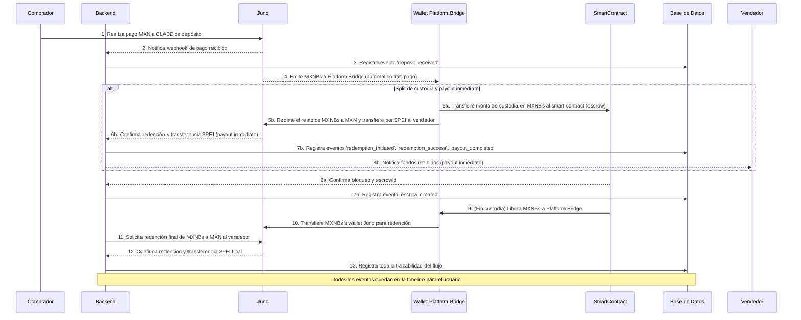
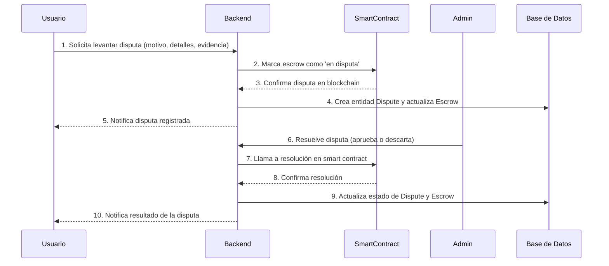
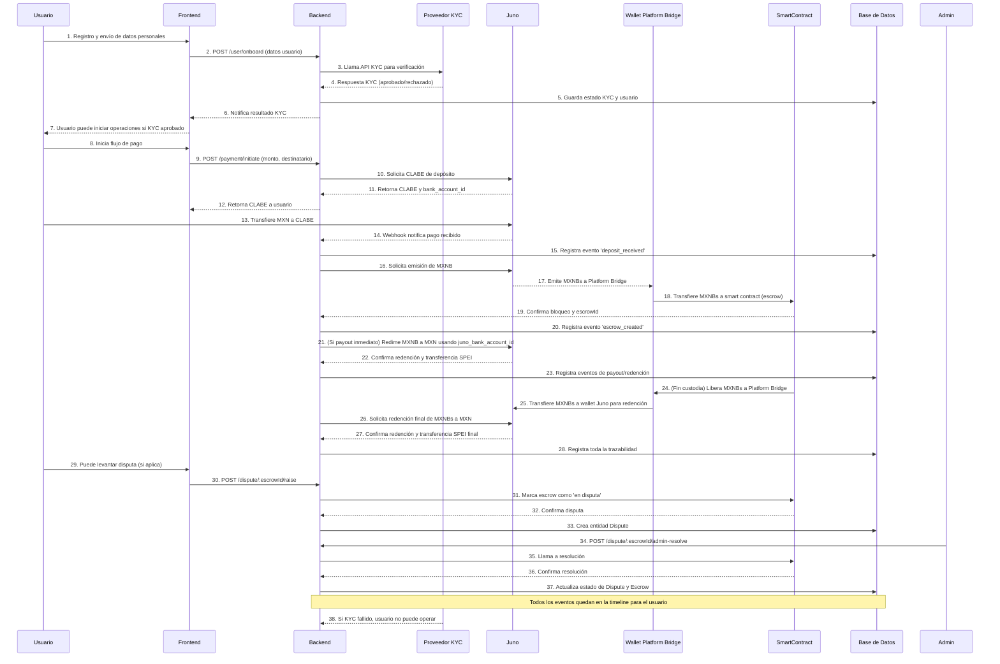

# Kustodia Escrow Automation & Product Roadmap

## Resumen Técnico y de Roadmap

### Overview
Kustodia es una plataforma de pagos P2P con custodia cripto (MXNB) y split automático entre payout inmediato y periodo de custodia, integrando smart contracts en Arbitrum y APIs bancarias (Juno/Bitso).

---

## Roadmap y Epics

### Backend
- [ ] Esperar respuesta de soporte Juno/Bitso para habilitar endpoint de plataforma y API Key válida.
- [ ] Implementar lógica de emisión/redención de MXNbs vía API/custodio autorizado.
- [ ] Implementar split automático del monto recibido: calcular % payout inmediato vs % custodia.
- [ ] Integrar lógica de bloqueo y liberación de MXNbs en smart contract (Arbitrum).
- [ ] Añadir endpoints y eventos para monitorear el estado de la custodia y liberar payout tras periodo/reclamos.
- [ ] Registrar todos los movimientos (emisión, bloqueo, redención, payout) en la base de datos.

### Frontend
- [ ] Mostrar ambos CLABEs y explicar el split de pagos en la UI.
- [ ] Reflejar en el dashboard los estados de payout inmediato y en custodia.
- [ ] Añadir notificaciones sobre liberación de fondos y payout final.

### Integración y QA
- [ ] Pruebas E2E del flujo completo: pago, split, custodia, liberación y payout.
- [ ] Validar que nunca se expongan MXNbs al usuario final.
- [ ] Actualizar documentación y diagramas según feedback de QA y soporte.

### Roadmap y Epics
- [ ] Mantener actualizado el roadmap con los avances y bloqueos.
- [ ] Revisar y ajustar el split (%) según necesidades de negocio y feedback de usuarios.

---

## Automatización de Escrow: Resumen del Flujo

### 1. Fondeo de Escrow
- Automatizado en Arbitrum Sepolia.
- El script registra el escrowId retornado y el periodo de custodia.

### 2. Liberación de Custodia
- Script robusto, acepta cualquier escrowId (incluyendo 0).
- El release solo es posible tras terminar el periodo de custodia.

### 3. Consulta de Tiempo Restante
- Script: `src/scripts/queryEscrowTime.ts`
- Muestra tiempo restante, fecha/hora de inicio y fin del periodo de custodia (local y UTC).
- Uso:
  ```bash
  npx ts-node src/scripts/queryEscrowTime.ts <escrowId>
  ```

### 4. Variables de Entorno
- Todos los scripts cargan `.env` automáticamente.
- Ejemplo de variables requeridas:
  - `ETH_RPC_URL`
  - `MOCK_ERC20_ADDRESS`
  - `ESCROW_CONTRACT_ADDRESS`
  - `ESCROW_PRIVATE_KEY`
  - `ESCROW_BRIDGE_WALLET`
  - `JUNO_STAGE_API_KEY`
  - `JUNO_STAGE_API_SECRET`

---

## Ejemplo de salida del script de consulta
```
Faltan 71h 59m 59s para que termine el periodo de custodia del escrowId 0.
Fecha/hora inicio (local): 27/05/2025, 18:59:08
Fecha/hora inicio (UTC):   2025-05-27T23:59:08.000Z
Fecha/hora fin (local):    30/05/2025, 18:59:08
Fecha/hora fin (UTC):      2025-05-30T23:59:08.000Z
```

---

## Avances de Mayo 2025

---

## Flujo End-to-End: Pago, Custodia, Redención y Payout

### Explicación paso a paso

1. **El comprador realiza un pago en MXN** a la CLABE de depósito proporcionada por Juno.
2. **Juno notifica al backend** vía webhook que se ha recibido el pago.
3. **El backend registra el evento** `deposit_received` en la base de datos.
4. **El backend solicita a Juno la emisión de MXNBs** equivalentes al monto recibido.
5. **Juno emite los MXNBs** y los transfiere a la wallet “Platform Bridge” (wallet puente de la plataforma).
6. **El backend transfiere los MXNBs desde la wallet Platform Bridge al smart contract de escrow** en Arbitrum, bloqueando los fondos según el split configurado (payout inmediato y/o custodia).
7. **El smart contract confirma el bloqueo** y retorna el `escrowId` al backend.
8. **El backend registra el evento** `escrow_created` en la base de datos.
9. **(Si hay payout inmediato)** El backend solicita la redención de MXNBs a MXN usando el UUID de la cuenta bancaria (`juno_bank_account_id`) del vendedor, vía Juno.
10. **Juno realiza la redención** y transfiere los MXN al vendedor vía SPEI.
11. **El backend registra los eventos** `redemption_initiated`, `redemption_success` y `payout_completed` en la base de datos.
12. **El backend notifica al vendedor** que los fondos han sido recibidos.
13. **Cuando termina el periodo de custodia**, el backend libera los MXNBs del smart contract y los transfiere de regreso a la wallet Platform Bridge.
14. **El backend transfiere los MXNBs desde la wallet Platform Bridge a la wallet de Juno** (wallet custodio de la plataforma).
15. **El backend solicita la redención de MXNBs a MXN** (por el monto liberado de la custodia) usando el UUID de la cuenta bancaria del vendedor.
16. **Juno realiza la redención** y transfiere los MXN al vendedor vía SPEI.
17. **El backend registra todos los eventos** en la base de datos y los muestra en la timeline del usuario.

---

## Diagrama End-to-End: Pago, Custodia, Redención y Payout



---

## Flujo de Disputa

Durante una disputa, los fondos permanecen bloqueados en el smart contract hasta que un administrador resuelva el caso. El proceso es el siguiente:

1. **El usuario (comprador o vendedor) levanta una disputa** sobre un escrow activo antes de que termine la custodia.
2. **El backend recibe la solicitud** con motivo, detalles y evidencia opcional.
3. **El backend llama al smart contract** para marcar el escrow como 'en disputa' en la blockchain.
4. **Se crea una entidad Dispute** en la base de datos, vinculada al escrow y al usuario que la levantó, con estatus `pending`.
5. **Se actualiza la entidad Escrow** para reflejar el estado de disputa y se agrega un registro en el historial de disputa.
6. **El backend expone el timeline de disputa** combinando la historia legacy y los eventos de la entidad Dispute.
7. **Un administrador puede resolver la disputa** indicando si se aprueba o se descarta:
    - Si **aprobada**: el escrow se marca como `reverted`, la disputa como `resolved`, y se registra el hash de la transacción de resolución en el smart contract.
    - Si **descartada**: la disputa se marca como `dismissed`, y el escrow puede volver a estado normal si aplica.
8. **Todos los eventos de disputa** quedan registrados y aparecen en la timeline del usuario.

**Nota:** Mientras el escrow está en disputa, los MXNBs permanecen bloqueados en el smart contract y no se puede liberar ni redimir la custodia hasta que la disputa sea resuelta por un administrador.

### Diagrama de flujo de disputa



---

# Diagrama General de Flujos: KYC, Onboarding, Pagos, Custodia, Redención, Disputa



---

# Ejemplos de Endpoints y Payloads

## Onboarding y KYC

### Endpoint
```
POST /user/onboard
```
#### Payload ejemplo
```json
{
  "nombre": "Juan Pérez",
  "email": "juan@correo.com",
  "telefono": "+5215555555555",
  "curp": "PEPJ800101HDFLLL01",
  "direccion": "Calle Falsa 123, CDMX",
  "banco_clabe": "032180000118359719",
  "rfc": "PEPJ800101AAA"
}
```
#### Respuesta posible
```json
{
  "success": true,
  "user_id": 123,
  "kyc_status": "approved"
}
```

## Inicio de Pago

### Endpoint
```
POST /payment/initiate
```
#### Payload ejemplo
```json
{
  "monto": 15000,
  "destinatario_id": 456
}
```
#### Respuesta posible
```json
{
  "success": true,
  "clabe": "646180157000000000",
  "bank_account_id": "uuid-juno-bank-account"
}
```

## Redención y Payout

### Endpoint (interno backend)
```
POST /payment/redeem
```
#### Payload ejemplo
```json
{
  "escrow_id": 789,
  "juno_bank_account_id": "uuid-juno-bank-account",
  "monto": 15000
}
```
#### Respuesta posible
```json
{
  "success": true,
  "status": "redemption_initiated",
  "juno_tx_id": "juno-redemption-tx-id"
}
```

## Disputa

### Endpoint
```
POST /dispute/:escrowId/raise
```
#### Payload ejemplo
```json
{
  "reason": "Producto no recibido",
  "details": "Han pasado 7 días y el vendedor no entrega.",
  "evidence": "https://url-a-evidencia.com/archivo.jpg"
}
```
#### Respuesta posible
```json
{
  "success": true,
  "message": "Disputa registrada",
  "dispute": { "status": "pending" }
}
```

## Resolución de Disputa (admin)

### Endpoint
```
POST /dispute/:escrowId/admin-resolve
```
#### Payload ejemplo
```json
{
  "resolution": "approved",
  "adminNotes": "El vendedor no entregó en tiempo. Se revierte el pago."
}
```
#### Respuesta posible
```json
{
  "success": true,
  "status": "resolved",
  "contractTxHash": "0xabc..."
}
```

---

Cada endpoint y payload está diseñado para facilitar la integración y automatización del flujo completo, incluyendo onboarding/KYC, pagos, custodia, redención, payout y disputa. Si necesitas ejemplos de respuestas de error, flujos alternativos o endpoints adicionales, avísame.

- La línea de tiempo de eventos de pago (frontend) ahora muestra íconos para todos los tipos de evento relevantes: redención, payout, disputa, etc.
- La entidad User en la base de datos ahora incluye el campo `juno_bank_account_id` para almacenar el UUID de la cuenta bancaria registrada en Juno.
- El flujo de redención y payout ahora utiliza el UUID de Juno (`juno_bank_account_id`) como destino, en vez del CLABE, cumpliendo con las mejores prácticas y requisitos de la API de Juno.
- Se mejoró el mapeo y automatización de usuarios con cuentas bancarias externas registradas en Juno.
- Próximo paso: ejecutar una prueba completa de pago end-to-end para validar toda la integración (escrow, redención, payout).

---

## Assessment y Plan de Acción (Mayo 2025)

### Flow Actual (antes de hoy)
- CLABE de depósito y payout generados y almacenados por usuario.
- El backend intentaba crear CLABE vía Juno, pero había problemas con la autenticación y el tipo de API key.
- Los pagos y payouts eran gestionados directamente en MXN vía Juno, sin integración real de custodia cripto ni MXNb.
- El frontend muestra ambos CLABEs, pero el flujo de pagos y custodia era lineal y sin split.
- No existía un split entre payout inmediato y monto en custodia.
- No había integración real con smart contracts de Arbitrum ni emisión/redención de MXNbs.

### Nuevo Flow Propuesto (post-implementación de hoy)
- Recepción del 100% del pago en el deposit_clabe vía Juno.
- Emisión de MXNbs equivalentes al monto recibido.
- Split automático:
    - **Payout inmediato (%):** Redención de MXNbs y payout en MXN al deposit_clabe.
    - **Custodia (%):** Bloqueo de MXNbs en smart contract (Arbitrum). Tras el periodo y sin reclamos, redención de MXNbs y payout en MXN al payout_clabe.
- El usuario nunca recibe MXNb, solo MXN.
- Toda la lógica y persistencia está centralizada en el backend.

---

## Contacto y soporte
Para dudas o soporte, contactar al equipo de desarrollo Kustodia.
